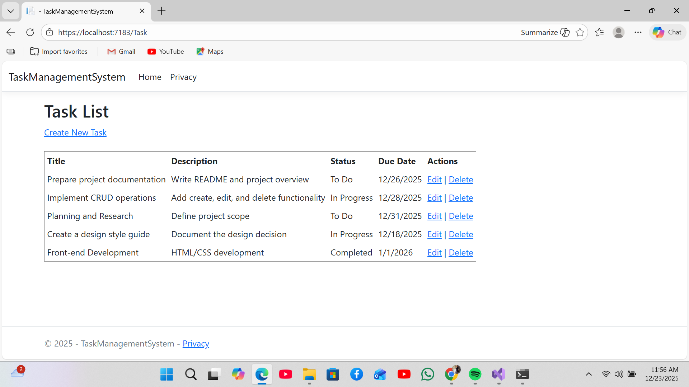
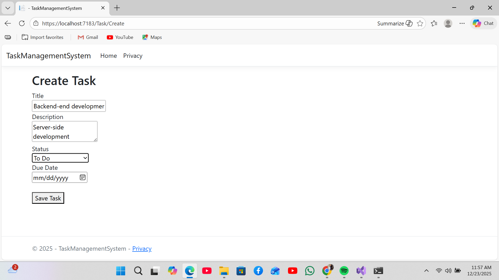

# Task Management System

## Overview
The Task Management System is a structured web application designed to manage tasks through clear and predictable workflows. The system allows tasks to be created, updated, viewed, and deleted while maintaining correctness, validation, and clean separation of concerns.

This project focuses on reasoning about application state, user input, and backend maintainability rather than feature complexity.

## Problem Statement
Many simple internal systems fail due to poor validation, tightly coupled logic, and unclear workflows, resulting in inconsistent application state and difficult long-term maintenance.

This application addresses that problem by enforcing structured task workflows and explicit server-side validation.

## Core Features
- Create, view, update, and delete tasks
- Server-side validation for task data
- Explicit handling of invalid user input
- MVC separation between models, controllers, and views
- Database persistence using Entity Framework Core

## Technology Stack
- Language: C#
- Framework: ASP.NET Core MVC
- ORM: Entity Framework Core
- Database: SQL Server
- Architecture: Model–View–Controller (MVC)

## System Design and Engineering Decisions
- Responsibilities are clearly separated across application layers to reduce coupling
- Validation is enforced server-side to ensure consistent application state
- Controller logic is written explicitly to improve readability and maintainability
- Database access is managed through Entity Framework Core to reduce manual SQL errors

## Assumptions and Limitations
- Single-user context with no authentication or authorization
- No task assignment, collaboration, or notifications
- No prioritization or deadline tracking
- Designed to demonstrate structure and correctness rather than feature breadth

## What I Would Improve Next
- User authentication and task ownership
- Task status workflows and lifecycle management
- Filtering and sorting for large task lists
- Audit tracking for task changes

## Outcome
This project demonstrates disciplined implementation of CRUD workflows, validation, and application state management in an ASP.NET Core MVC environment.

## 📸 Screenshots

### Tasks List

### Create Task

## Author
Emely Mokgadi Machete  
Juniour Software Developer
